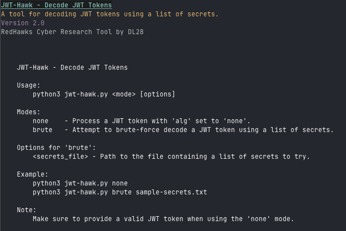

# JWT-Hawk

## Description
JWT-Hawk is a Python tool used for decoding JWT tokens by trying multiple secrets from a provided list. It extracts and prints the header values and payload values (if the secret matches) of a given JWT token. 

## Dependencies
- `jwt`
- `termcolor`
- `pyfiglet`

## Usage
1. Clone the repository: `git clone https://github.com/NavidNaf/JWT-Hawk`
2. Change the directory: `cd JWT-Hawk`
3. Install the dependencies: `pip3 install -r requirements.txt`
4. Create a file with the list of secrets that you want to try.
5. Run the script: `python3 jwt_hawk.py <secrets_file>`
   - `<secrets_file>` is the name of the file that contains the secrets. Make sure it's in the same directory as the script.
6. Enter the JWT token when prompted.
7. The tool will attempt to decode the JWT token using each secret in the list.
8. If a match is found, the tool will print the header and payload values along with the decoded signature.
9. If no match is found, the tool will print a message saying that it did not find any secret to decode.

## Author
- DL28 (NavidNaf)

## License
This project is licensed under the MIT License. See the [LICENSE](LICENSE) file for details.

Contributions are welcome! If you find a bug or have an idea for a new feature, please create an issue or submit a pull request. 
